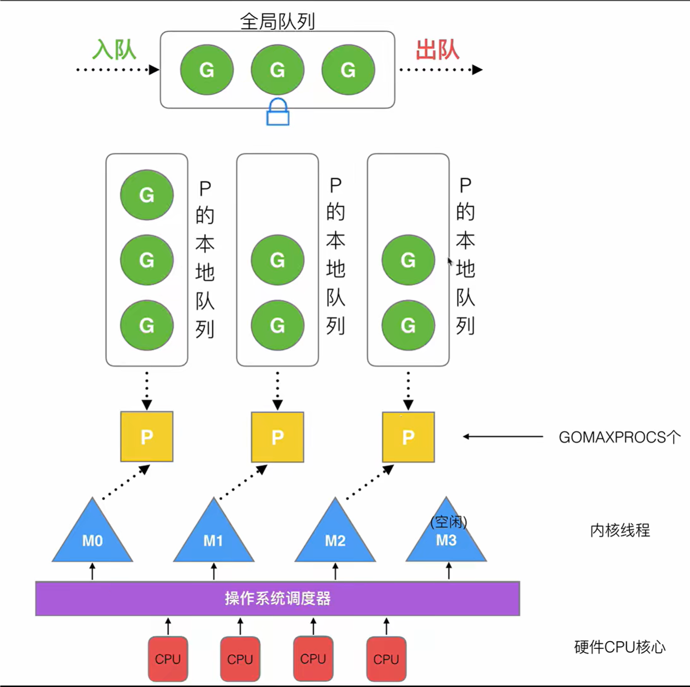

# GMP
B站讲解视频《Golang深入理解GMP模型》
https://www.bilibili.com/video/BV19r4y1w7Nx?p=1&vd_source=e9d96e3ff5d68e6350d7ad85275b2492

## 重点介绍
1. 为了解决 Go 早期多线程 M 对应多协程 G 调度器的**全局锁、中心化状态带来的锁竞争导致的性能
下降**等问题，Go 开发者引入了处理器 P结构，形成了当前经典的 GMP 调度模型;
2. Go 调度器是指：运行时在用户态提供的多个函数组成的一种机制，目的是高效地调度 G到 M上去
执行;
3. Go 调度器的核心思想是:**尽可能复用线程 M**，避免频繁的线程创建和销毁;**利用多核并行能力**
   限制同时运行(不包含阻塞)的 M 线程数 等于 CPU 的核心数目; **Work stealing 任务窃取机制**
   M 可以从其他 M 绑定的 P的运行队列偷取 G 执行;**Hand Off 交接机制**，为了提高效率，M 阻塞
   时，会将 M 上P的运行队列交给其他M 执行;**基于协作的抢占机制**，为了保证公平性和防止
   Goroutine 饥饿问题，Go 程序会保证每个 G运行 10ms 就让出 M，交给其他 G去执行，这个 G 运
   行 10ms 就让出 M 的机制，是由单独的系统监控线程通过 retake()函数给当前的 G发送抢占信号实
   现的，如果所在的 P没有陷入系统调用且没有满，让出的 G优先进入本地 P队列，否则进入全局队
   列;**基于信号的真抢占机制**，Go1.14 引入了基于信号的抢占式调度机制，解决了 GC 垃圾回收和栈扫
   描时无法被抢占的问题;
4. 由于**数据局部性**，新创建的 G优先放入本地队列，在本地队列满了时，会将本地队列的一半 G和
   新创建的 G打乱顺序，一起放入全局队列;本地队列如果一直没有满，也不用担心，全局队列的 G永
   远会有 1/61 的机会被获取到，调度循环中，优先从本地队列获取 G执行，不过每隔61次，就会直接
   从全局队列获取，至于为啥是 61 次，Dmitry 的视频讲解了，就是要一个既不大又不小的数，而且不
   能跟其他的常见的2的幂次方的数如 64 或 48 重合;
5. M 优先执行其所绑定的 P的本地运行队列中的 G，如果本地队列没有 G，则会从全局队列获取，为
   了**提高效率和负载均衡**，会从全局队列获取多个G，而不是只取一个，个数是自己应该从全局队列中
   承担的，globrunqsize/nprocs + 1;同样，当全局队列没有时，会从其他 M 的P 上偷取 G 来运行
   偷取的个数通常是其他 P运行队列的一半;
6. G在运行时中的状态可以简化成三种:等待中 _Gwaiting、可运行_Grunnable、运行中_Grunning，
   运行期间大部分情况是在这三种状态间来回切换；
7. M 的状态可以简化为只有两种:自旋和非自旋;**自旋状态，表示 M 绑定了P又没有获取 G**;非自
   旋状态，表示正在执行 Go 代码中，或正在进入系统调用，或空闲;
8. P结构体中最重要的，是持有一个可运行 G的长度为 256 的本地环形队列，可以通过 CAS 的方式
   无锁访问，跟需要加锁访问的全局队列 schedt.runq 相对应;
9. 调度器的启动逻辑是:初始化 g0 和 m0，并将二者互相绑定， m0 是程序启动后的初始线程，g0
   是 m0 线程的系统栈代表的 G结构体，负责普通 G在 M 上的调度切换 -->runtime.schedinit():负
   责M、P的初始化过程，分别调用runtime.mcommoninit()初始化 M 的全局队列allm 、调用
   runtime.procresize()初始化全局 P队列 allp -->runtime.newproc():负责获取空闲的 G 或创建新
   的 G--> runtime.mstart()启动调度循环;
10. 调度器的循环逻辑是:运行函数 schedule()-->通过 runtime.globrunqget()从全局队列、通过
    runtime.runqget()从 P本地队列、 runtime.findrunnable 从各个地方，获取一个可执行的 G -->调
    用 runtime.execute()执行 G--> 调用 runtime.gogo()在汇编代码层面上真正执行G -->调用
    runtime.goexit0()执行 G的清理工作，重新将 G加入P的空闲队列 -->调用 runtime.schedule()进
    入下一次调度循环。