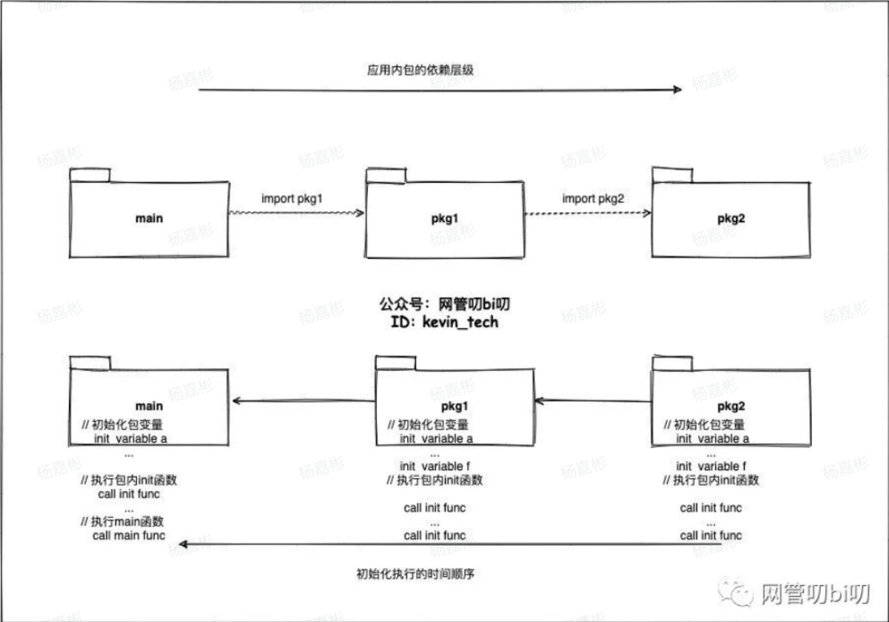

<!-- TOC -->
* [程序初始化](#程序初始化)
<!-- TOC -->
# 程序初始化
在Go语言中，init 函数有特殊的用途和规则。init 函数用于进行包级别的变量初始化和设置，它在程序启动时自动被调用，且不需要手动调用。每个Go程序可以包含多个init函数，它们的执行顺序是按照源文件中的出现顺序，从上到下依次执行。

这种设计允许开发者将初始化逻辑分散到不同的init函数中，使得初始化过程更加模块化和清晰。

