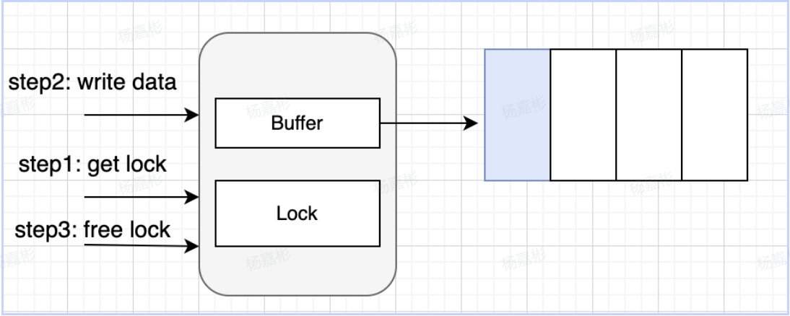

# Channel
- 用于不同的Goroutine之间通信
- Channel是一个可以收发数据的管道

## Channel初始化
1. 声明方式
```go
var channel_name chan channel_type
var channel_name [size]chan channel_type // 声明一个Channel，其容量大小为size
```
2. 声明并未初始化，为nil，配合make对其进行初始化
```go
channel_name = make(chan channel_type)
channel_name = make(chan channel_type, size)
```
或
```go
channel_name := make(chan channel_type)
channel_name := make(chan channel_type, size)
```
## Channel操作
```go
ch := make(chan int)    // 创建一个管道ch
ch <- v                 // 向管道ch中发送数据v
v := <-ch               // 从管道中读取数据存储到变量v
close(ch)               // 关闭管道ch
```
关闭的管道仍然可以从中接收数据，只是接收到的数据永远是零值。
### 判定读取
### For range读取

## 双向Channel和单向Channel
channel根据其功能又可以分为双向channel和单向channel，双向channel既可发送数据又可接收数据，单向channel要么只能发送数据，要么只能接收数据。

- 定义单向读Channel
```go
var ch = make(chan int)
type RChannel = <-chan int  // 定义类型
var rec RChannel = ch
```
- 定义单向写Channel
```go
var ch = make(chan int)
type SChannel = chan<- int  // 定义类型
var send SChannel = ch 
```
## Channel解决了什么问题？
Golang中重要思想：不以共享内存来通信，而以通信来共享内存。
即协程之间可以利用Channel来传递数据

Channel分为两类：

**无论有无缓冲的Channel，内部都会有一把锁来控制并发访问。同时Channel底层一定有一个队列，来存储数据**
1. 无缓冲Channel

可以理解为同步模式，即写入一个，如果没有消费者在消费，写入就会阻塞。

2. 有缓冲Channel 

可以理解为异步模式，即写入消息之后，即使还没被消费，只要队列没满，就可继续写入。

如果缓冲队列满了，发送还是会被阻塞。

**反向思考：如果有缓冲channel长期都处于满队列情况，那何必用有缓冲。所以预期在正常情况下，有缓冲 channel 都是异步交互的。**

### 扩展
上面说了当缓冲队列满了以后，继续往channel里面写数据，就会阻塞，那么利用这个特性，我们可以实现一个goroutine之间的锁。

## 关于Channel的几点总结
- 关闭一个未初始化的 channel 会产生 panic
- channel只能被关闭一次，对同一个channel重复关闭会产生 panic
- 向一个已关闭的 channel 发送消息会产生 panic
- 从一个已关闭的channel读取消息不会发生panic，会一直读取所有数据，直到零值管道定义类型的默认值（int为零值）
- channel读端和写端都可有多个goroutine操作，在一端关闭channel的时候，该channel读端的
  所有goroutine 都会收到channel已关闭的消息
- channel是并发安全的，多个goroutine同时读取channel中的数据，不会产生并发安全问题