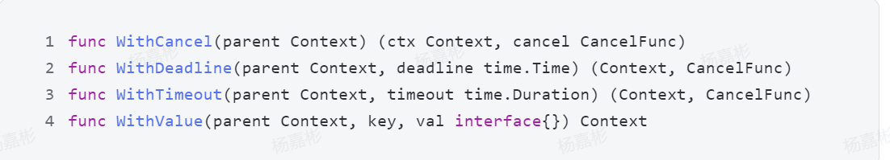
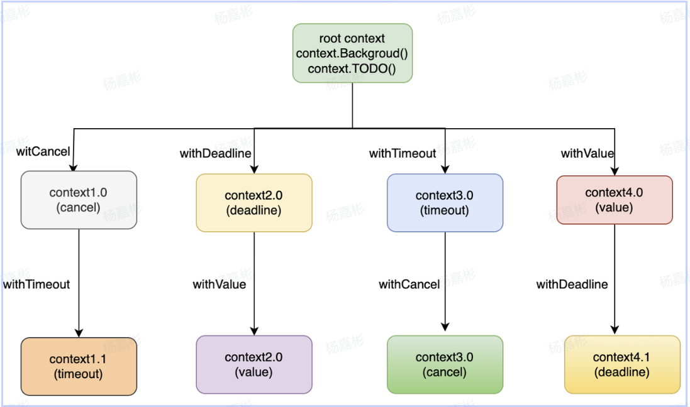

<!-- TOC -->
* [Context](#context)
  * [接口定义](#接口定义)
  * [Context创建](#context创建)
    * [根Context创建](#根context创建)
    * [Context创建](#context创建-1)
  * [用途](#用途)
    * [并发控制](#并发控制)
<!-- TOC -->
# Context
- Go语言1.7版本引入，标准库接口
- 主要用于：
1. 并发控制，控制协程退出
2. 上下文的信息传递

用来在父子goroutine间进行值传递以及发送cancel信号的一种机制

## 接口定义
```go
type Context interface {
	Deadline() (deadline time.Time, ok bool)
	Done() <-chan struct{}
	Err() error
	Value(key interface{}) interface{}
}
```
- Deadline：设置context.Context被取消的时间，即截止时间；
- Done：返回一个只读Channel，当Context被取消或者到达截止时间，这个Channel就会被关闭，表示Context的链路结束，多次调用会返回同一个Channel；
- Err：返回context.Context结束的原因，它会在Done返回的Channel被关闭时才会返回非空的；
  - 如果被取消，返回Canceled
  - 如果超时，返回DeadlineExceeded
- Value：从context.Context中获取键对应的值。对于同一个context，多次调用Value并传入相1同的Key会返回相同的结果，如果没有key，返回nil。

## Context创建
### 根Context创建
- Context.Background()
- Context.TODO()

### Context创建



## 用途
### 并发控制
- WithCancel：执行取消函数，控制goroutine关闭（当前上下文和子上下文都会取消）
- WithDeadline：没有到截止时间，可以手动调用取消函数控制关闭，如果到了截止时间，自动触发
- WithTimeout：与上面作用类似，第二个参数为时间长度，而不是某个时间点
- WithValue：创建子context用于传值，一般用于上下文信息的传递


