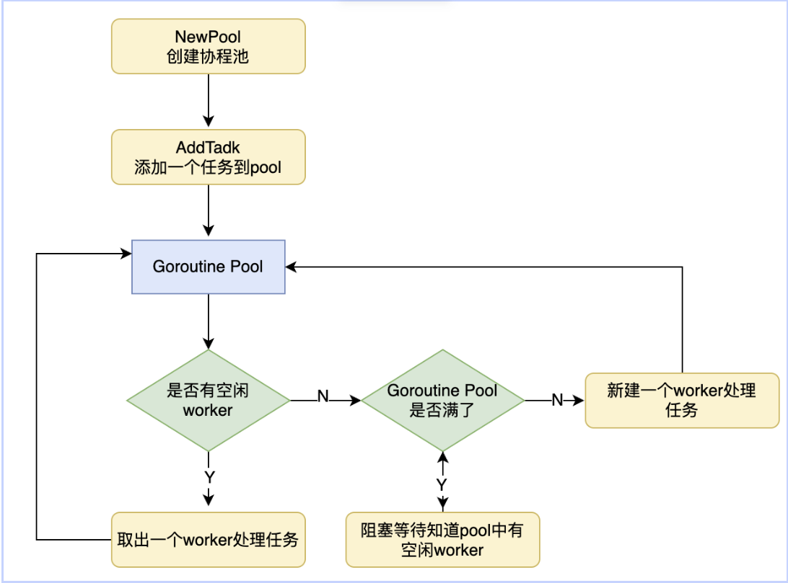

<!-- TOC -->
* [协程池](#协程池)
  * [协程池模型](#协程池模型)
    * [属性定义](#属性定义)
      * [Task](#task)
      * [Pool](#pool)
      * [worker](#worker)
    * [方法定义](#方法定义)
<!-- TOC -->
# 协程池
## 协程池模型
里面装有固定数量的goroutine，当有任务到来，会选择其中一个空闲goroutine执行，如果池子没有空闲goroutine，任务就会阻塞等待。

协程池存在有三个角色：Worker，Task，Pool

### 属性定义
- Worker：用于执行任务的goroutine
- Task：具体的任务
- Pool：池子
#### Task
```go
type Task struct {
	f func() error
}
```
#### Pool
```go
type Pool struct {
	RunningWorkers int64
	Capacity       int64        // goroutine数量
	JobCh          chan *Task   // 任务队列，存放任务，用于worker取任务
	sync.Mutex
}
```
#### worker
```go
// p为Pool对象指针
for task := range p.JobCh {
	do ...
}
```
执行任务单元。不断地从任务队列里面取任务执行，worker的数量就是协程池里协程的数量，由Pool的参数WorkerNum指定。

### 方法定义
```go
func NewTask(funcArg func() error) *Task //创建一个任务，参数是一个函数，返回值是一个Task类型
func NewPool(Capacity int, taskNum int) *Pool //返回一个协程数量固定为workerNum协程池对象指针，其任务队列的长度为taskNum
```
```go
func (p *Pool) AddTask(task *Task) //往协程池添加任务，如果当前运行着的worker数量小于协程池worker容量，则立即启动一个协程worker来处理任务，否则将任务添加到任务队列
func (p *Pool) Run()
```
将协程池跑起来，启动一个worker来处理任务。
协程池处理任务流程图：
