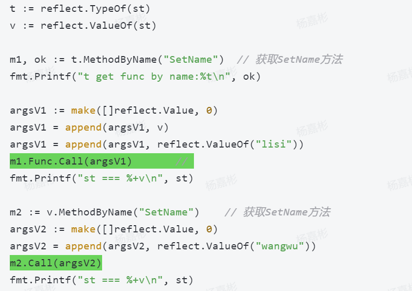

<!-- TOC -->
* [反射](#反射)
  * [Go语言反射](#go语言反射)
    * [reflect.TypeOf()](#reflecttypeof)
    * [reflect.ValueOf()](#reflectvalueof)
    * [Go语言数据种类](#go语言数据种类)
  * [反射使用](#反射使用)
    * [值对象](#值对象)
      * [获取Struct反射值](#获取struct反射值)
      * [获取Map反射值](#获取map反射值)
      * [获取Slice反射值](#获取slice反射值)
    * [类型对象](#类型对象)
      * [Struct反射类型](#struct反射类型)
      * [指针反射类型](#指针反射类型)
      * [函数反射类型](#函数反射类型)
      * [反射获取Struct方法](#反射获取struct方法)
    * [通过反射调用方法](#通过反射调用方法)
    * [通过反射设置值](#通过反射设置值)
    * [结构体标签](#结构体标签)
  * [反射的优缺点](#反射的优缺点)
<!-- TOC -->
# 反射
反射可以在程序运行时访问、检测和修改它本身状态，如检查变量的类型和值，调用方法，甚至可以修改值。

## Go语言反射
- Go语言内置reflect包
- reflect.Type是一个接口，定义了很多跟类型相关的方法
- reflect.Value是一个结构体，绑定了很多跟值相关的方法

### reflect.TypeOf()
当某个类型实现了这个接口，才能获取到它的类型。
reflect包内类型描述符是未导出类型，只能通过reflect.TypeOf()方法获取reflect.Type的值。

解释：当我们使用reflect.TypeOf函数获取一个变量的类型时，反射机制会根据变量的实际类型，创建一个对应的 reflect.Type 接囗的实现，并返回这个实现。这个实现包含了变量的类型信息，例如类型名称、字段、方法等。

### reflect.ValueOf()
与上述reflect.TypeOf()同理。

### Go语言数据种类
- 26种，定义在src/reflect/type.go文件中

```go
type WrapInt int

func main() {
	var num1 int = 100
	var num2 WrapInt = 1000
	
	num1 = int(num2)
	
	typeNum1 := reflect.TypeOf(num1)
	typeNum2 := reflect.Typeof(num2)
}
```
typeNum1.String()与typeNum2.String()不一致，前者为int，后者为WrapInt

typeNum1.Kind()与typeNum2.Kind()一致，底层实现都为int

## 反射使用

### 值对象
#### 获取Struct反射值
- reflect.Value.NumField()
- reflect.Value.Field(i)
#### 获取Map反射值
- reflect.Value.MapKeys()
- reflect.Value.MapIndex(i)
#### 获取Slice反射值
- reflect.Value.Len()
- reflect.Value.Index(i)

### 类型对象
#### Struct反射类型
#### 指针反射类型
- reflect.Value.Elem()

注意需要先使用ptr.Elem()获取具体类型后，才能用.Name()和其他.NumField()等方法。
#### 函数反射类型
- reflect.Value.NumIn()
- reflect.Value.In(i)
- reflect.Value.NumOut()
- reflect.Value.Out(i)

#### 反射获取Struct方法
- reflect.Value.NumMethod()
- reflect.Value.Method(i)


### 通过反射调用方法

- reflect.Type.MethodByName()方法获取到的reflect.Method对象，必须使用Func字段，而且要传入reflect.Value作为第一个参数。
```go
m1.Func.Call(argsV1)
```
- reflect.Value.MethodByName()方法获取到的reflect.Method对象，不需要传入reflect.Value作为第一个参数，可直接通过Call发起方法调用。
```go
m2.Call(argsV2) 
```
### 通过反射设置值
- CanAddr()判断是否可寻址
1. reflect.Value.Elem()方法得到具体的类型可寻址
2. 对切片进行反射时，通过reflect.Value.Index(i)获取到的reflect.Value对象是可以寻址的，而数组反射不可寻址
3. 通过结构体的指针获取到的字段也是可寻址
- CanSet()判断值是否可修改
- SetInt()，SetUnit()，SetFloat()等方法修改对应类型值

### 结构体标签
在定义结构体的时候，可以为每个字段后面加一个标签，即StructTag，标签就是一组键值对，每个键值对用空格分开，这些标签信息可以通过反射获取。
```go
f := t.Field(i)
fmt.Println(f.Tag)
```

## 反射的优缺点
- 优点：提升程序代码灵活性，根据条件在程序运行时灵活的调用函数，并且修改源代码结构
- 缺点：性能影响，反射过程中存在大量的内存开辟和gc过程，导致程序的性能降低